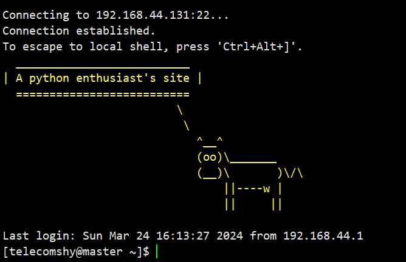

Cool Login Banner
==================

感谢超cool的 `cowsay <https://github.com/tnalpgge/rank-amateur-cowsay>`_, `pyfiglet <https://github.com/pwaller/pyfiglet>`_
和 `colorama <https://github.com/tartley/colorama>`_ 。

快速开始
---------

Cool Login Banner 可以快捷方便的定制你的linux登录界面，比如:

.. code-block::

    from cool_login_banner import BannerSetter, CowsayEngine

    bs = BannerSetter(CowsayEngine, host='192.168.44.131', user='username', password='password')
    bs.set_ssh_banner(text="A python enthusiast's site", name='cow', fore_color='lightyellow_ex', styles=['blink'])

你的登录界面就会变成这样：

恢复也很容易：

.. code-block::

    clb.clear_ssh_banner()

使用说明
----------

基本用法
~~~~~~~~~~

Cool Login Banner 使用很容易，创建 ``BannerSetter`` 对象，指定 banner 生成引擎，然后调用不同的方法即可设置相应的服务器登陆页面。

如果提供了 ``host`` 参数，内部会使用 :py:class:`fabric.Connection` 进行远程连接。如果本地执行，则无需提供 ``host``, 内部会使用
``invoke.sudo`` 执行指令。

``BannerSetter`` 的函数签名是：

.. code-block:: python

    BannerSetter(engine: Engine, host: str | None = None, port: int = 22, user: str | None = None, password: str | None = None, encoding: str = 'utf8', **kwargs: any) -> None

提供了四种方法，可以修改不同的login登陆页面：

- ``set_ssh_banner`` : 修改ssh远程登陆页面

引擎介绍
~~~~~~~~~~

注意事项
----------

1. 账号需要有sudo权限，如必要还需通过 ``password`` 参数提供密码。
