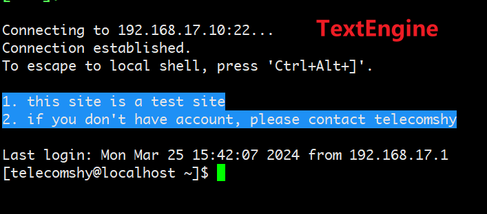
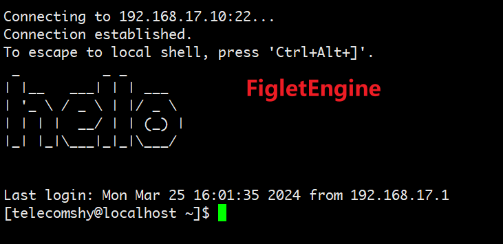
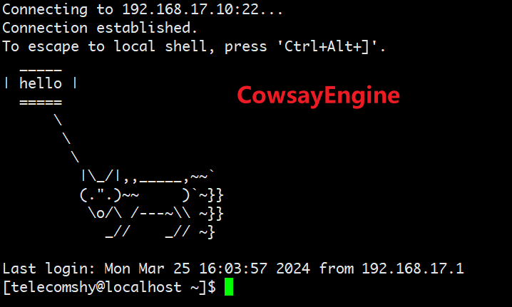
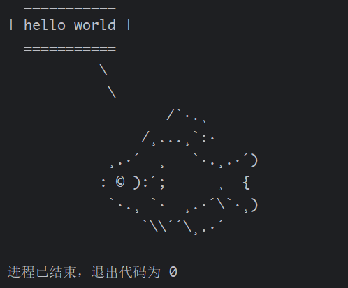
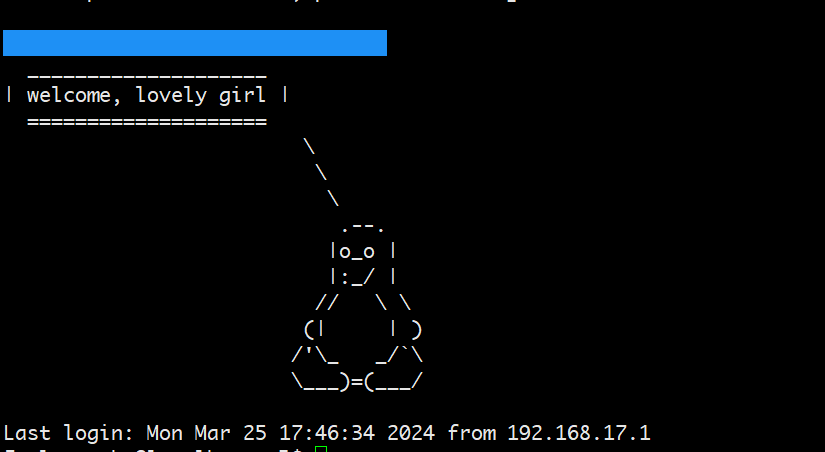

Cool Login Banner
==================

方便快捷的定制好玩的linux登录界面。

目录
===========

- `安装`_
- `描述`_
- `基本用法`_
   * `远程或本地`_
   * `修改不同的banner`_
   * `banner引擎`_
   * `自定义banner`_
- `说明`_

安装
----------

尚未发布...

描述
----------

Cool Login Banner 设置主机登陆界面最快只需要2步：

1. 创建 ``BannerSetter`` 对象。
2. 调用不同的方法设置对应的登陆banner。

.. code-block:: python

    from cool_login_banner import BannerSetter, CowsayEngine

    bs = BannerSetter(CowsayEngine, host='192.168.44.131', user='username', port=22, password='password')
    bs.set_ssh_banner(text="A python enthusiast's site", pattern='cow', fore_color='lightyellow_ex', styles=['blink'])

登录主机，你的登录页面就变成这样了:

.. image:: ./docs/img/login_banner.gif
    :width: 400

恢复也很容易：

.. code-block:: python

    bs.clear_ssh_banner()

基于 ``colorama``, ``pyfiglet`` 和 ``cowsay``, 一共有三种不同风格的banner引擎：

基本用法
--------

远程或本地
~~~~~~~~~~~~~

``BannerSetter`` 类会根据是否传递 ``host`` 参数来判断是远程连接还是本地执行。

如果是远程登陆，所有关键字参数都会送给 ``fabric.Connection``, 除了 ``password`` 参数。因为 ``Connection``
如果需要设置登陆密码，需要在 ``connect_kwargs`` 这个关键字参数里面设置，我觉得很不方便，进行了合并。

本机执行程序的话，除了 ``engine``, 就不用传递额外参数了。不过不管是远程还是本机，账号需要有sudo的权限，如果sudo
需要密码，则需要提供 ``password`` 参数。

修改不同的banner
~~~~~~~~~~~~~~~~~~~

``BannerSetter`` 提供了四个方法，分别修改不同的login登陆页面：

- ``set_ssh_banner`` : 设置ssh远程登陆的banner，此登陆之前显示。内部修改 /etc/ssh/sshd_config 文件
- ``set_motd_banner`` : 设置成功登陆以后的banner。内部修改 /etc/motd 文件。
- ``set_tty_banner`` : 设置本机终端登陆的banner，在登陆之前显示。内部修改 /etc/issue 文件。
- ``set_telnet_banner`` : 设置telnet远程登陆的banner，在登陆之前显示。内部修改 /etc/issue_net 文件。

banner引擎
~~~~~~~~~~~~~~~~

``BannerSetter`` 的所有 ``set_`` 开头的方法实际上都是在内部调用了引擎的 ``generate_banner`` 方法生成
banner，两者的函数签名是一致的。

所有引擎的 ``generate_banner`` 方法都接受以下几个参数，同时进行了扩展：

- ``fore_color``: 设置banner的前景色
- ``back_color``: 设置banner的背景色
- ``styles``: 列表，可以指定banner的风格，比如闪烁，下划线...
- ``preview``: 生成banner的同时是否打印

可以通过以下几个方法查看内置的所有颜色，风格或者进行预览：

.. code-block:: python

    engine.fore_colors                  # 查看所有前景色名称
    engine.back_colors                  # 查看所有背景色名称
    engine.styles                       # 查看所有风格
    engine.preview_fore_colors()        # 预览前景色
    engine.preview_back_colors()        # 预览背景色
    engine.preview_styles()             # 预览风格

.. note::

    可以在 ``BannerSetter`` 实例上直接调用所有 ``engine`` 的方法。

**TextEngine**

``generate_banner`` 增加参数：

- ``text``: banner文字

**FigletEngine**

``generate_banner`` 增加参数：

- ``text``: banner文字
- ``font``: 生成的文字风格

增加特性：

- ``engine.figlet_fonts``: 查看所有支持的文字风格

**CowsayEngine**

``generate_banner`` 增加参数：

- ``text``: banner文本框内文字
- ``pattern``: 图案的名称，默认是一头牛。你甚至可以直接传入自己的图案。

.. code-block:: python

    engine = CowsayEngine()
    fish = r'''
    \
     \
            /`·.¸
         /¸...¸`:·
     ¸.·´  ¸   `·.¸.·´)
    : © ):´;      ¸  {
     `·.¸ `·  ¸.·´\`·¸)
         `\\´´\¸.·´
    '''
    engine.generate_banner('hello world', pattern=fish)

生成的banner如下：

增加特性和方法：

- ``engine.patterns``: 查看所有内置的图案名称
- ``engine.preview_patterns()`` 预览所有的图案

自定义banner
~~~~~~~~~~~~~~~~

虽然可以通过 ``BannerSetter`` 的 ``set_`` 开头方法直接设置登陆图案，但有时候，我们想要更多的控制。实际上，
我们可以先通过引擎生成图案，然后再调用 ``BannerSetter`` ``save_`` 开头的方法保存到主机即可。

下面是一个例子：

.. code-block:: python

    from cool_login_banner import BannerSetter, CowsayEngine, FigletEngine, TextEngine

    text_engine = TextEngine()
    cowsay_engine = CowsayEngine()
    banner_setter = BannerSetter(host='192.168.17.10', user='username', password='password')

    note_msg1 = "1. You must be a pretty girl\n"
    note_msg2 = "2. You must be over 18 years old\n"

    note_banner1 = text_engine.generate_banner(note_msg1, fore_color='red', styles=['blink'])
    note_banner2 = text_engine.generate_banner(note_msg2, back_color='blue', styles=['blink'])
    cowsay_banner = cowsay_engine.generate_banner('welcome, lovely girl', pattern='tux')

    banner = note_banner1 + note_banner2 + cowsay_banner
    banner_setter.save_ssh_banner(banner)

生成的登陆图案如下：

说明
----------

Cool Login Banner 只是简单的进行了组合。感谢超级cool的 `pyfiglet <https://github.com/pwaller/pyfiglet>`_,
`cowsay-python <https://github.com/VaasuDevanS/cowsay-python>`_, `colorama <https://github.com/tartley/colorama>`_ 。
